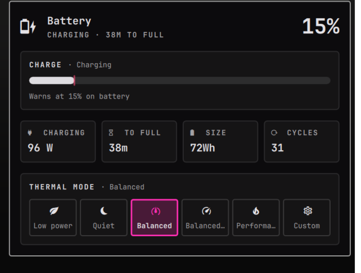

# Alienware Battery

A battery indicator for the Omarchy 4 bar, made to sit next to the
[Alienware](https://github.com/chr0nzz/omarchy-alienware) plugin.

Omarchy's own Power widget has a power-profiles picker, and power-profiles-daemon fights the
Alienware thermal profiles. This widget shows the battery without it, and puts the thermal
profiles in its place when `alienwarectl` is installed.

- Charge glyph, with the percentage beside it if you want
- Turns urgent on battery at or below a charge you pick
- Rate, time left or time to full, battery size, charge cycles and the charge limit when one holds
- Thermal profile buttons, through `alienwarectl`, and hidden when it is not installed
- Hides itself on a machine with no battery

It works without the Alienware plugin. You just don't get the thermal profiles.

## Install

```
omarchy plugin add https://github.com/chr0nzz/omarchy-alienware-battery.git --enable
```

Then remove Omarchy's Power widget from the bar settings, and drag this one where it was.

## Uninstall

```
omarchy plugin remove xyzlab.alienware-battery
```

Your settings stay in `~/.config/omarchy/shell.json` until you remove the widget from the bar.

## Use

| | |
|---|---|
| Left click | Open the details |
| Right click | Show or hide the percentage |
| Middle click | Next thermal profile |

In the details, arrow keys move between the profile buttons and Enter picks one.

## Settings

Through the Omarchy bar widget settings:

| Key | Default | |
|---|---|---|
| `showPercentage` | `false` | Percentage beside the icon |
| `lowBattery` | `15` | Charge, 5 to 50, that turns the icon urgent on battery |
| `showProfiles` | `true` | Thermal profiles when `alienwarectl` is installed |

## Keybind

```lua
o.bind("SUPER SHIFT", "B", "Battery", "omarchy-shell shell summon xyzlab.alienware-battery '{}'")
```

## Preview



## Development

```
npm test
```

The shell hot-reloads new files, but an edited QML file keeps running until `omarchy restart shell`.
